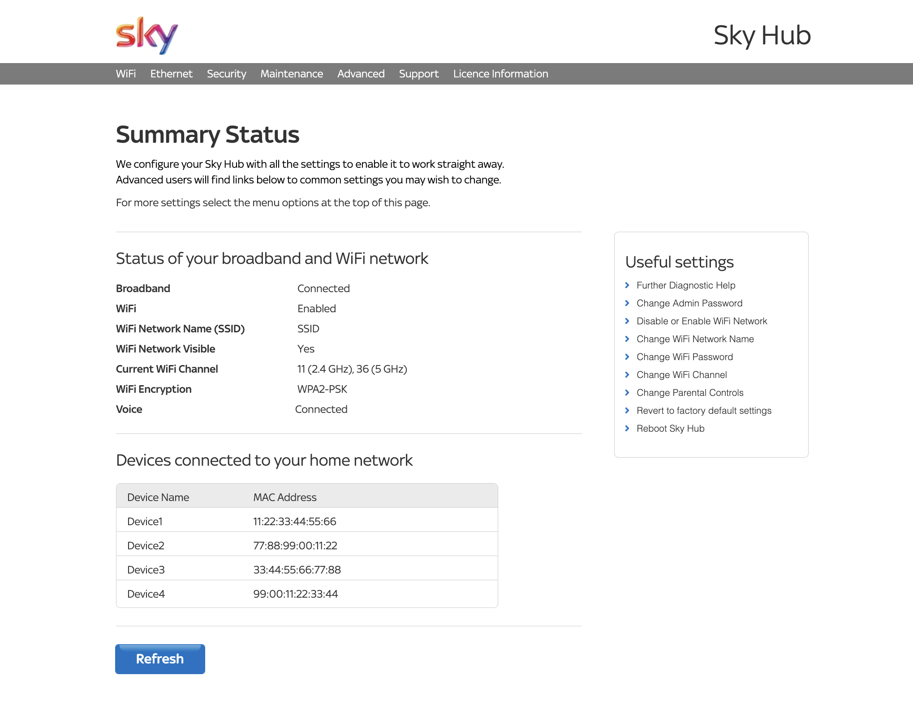

# Sky Hub Presence Detector

A Telegram bot offering presence detection by looking at connected devices to a Sky Hub router based router. All powered by an ESP8266 microcontroller.

## Why?

To understand when your flatmates/friends/relatives just arrived at home or are leaving (and because it was fun 😁).

## How?

The Sky Hub router homepage appears as follows:

By just parsing the Hub's homepage, you can easily understand what devices are connected to the WiFi.

Specifying a list of the MAC addresses of your flatmates' smartphones, you can keep track of when your flatmates arrive at home or leave and receive a Telegram notification to inform you.

## I'm down, what should I do?

The project has been configured on [Platformio](https://platformio.org/) (the platformio.ini file is included) with an ESP8266 (but it can easily be adapted to run on an ESP32 or a similar microcontroller supporting the Arduino framework).

To start, just rename `example.h` to `main.h` and customize the file as you prefer (the lines that you MUST change are indicated with a `CHANGEME` comment).

You will also need to create a Telegram bot (a guide can easily be found on Google) and copy-paste its `BOT_TOKEN` in `main.h`. Your `CHAT_ID` can also be easily obtained searching a guide on Google.

## Credits

The library is heavily inspired by the Home Assistant's [Sky Hub component](https://github.com/home-assistant/core/tree/dev/homeassistant/components/sky_hub).
